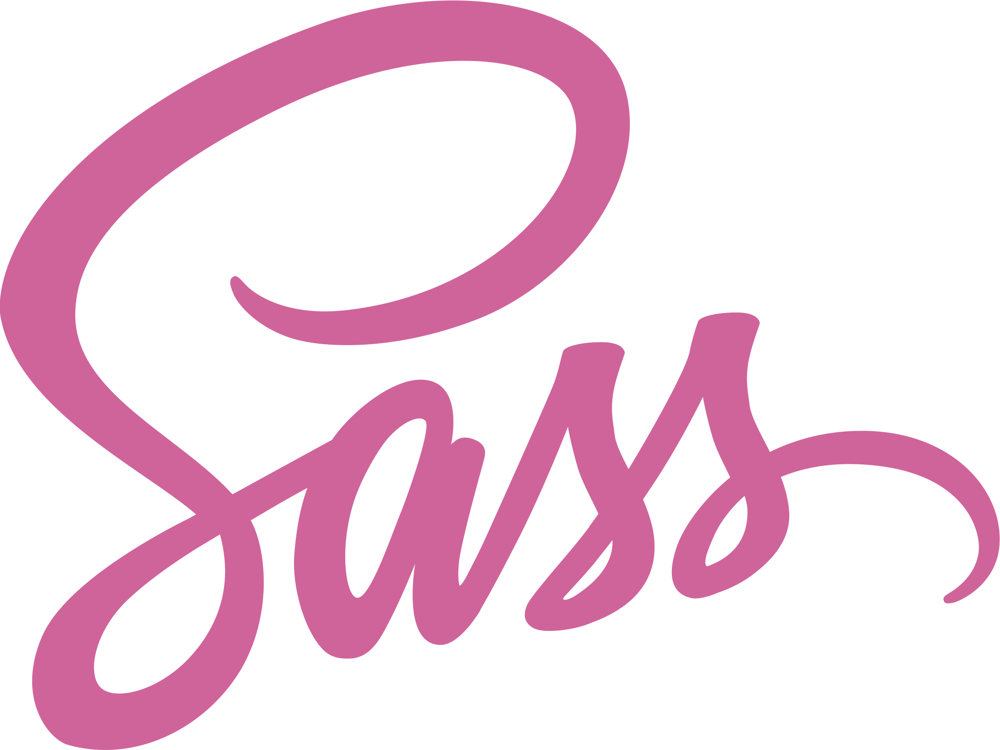

# **Szakdolgozat**

## Halgatói adatok
**Név**: Varga Zoltán  
**Neptun kód**: V64FGJ  
**Halgatói azonósító**: h270519  
## Témavezető
Dr. Bilicki Vilmos    
## Téma terv készitésének időpontja
A diplomamunka elkészitésével 2024/2025 I. félévben kezdtem el foglalkozni és remélhetőleg 2024/2025 II. félévében végzek.
## Diplomamunka címe:
Félévtervező
## Motiváció
A Szakdolgozatom célja, hogy egy olyan web aplikáció készitsek ami megkönyitené a tárgy felvételi időszakot a diákok társaim számára és egy olyan visszajelzéseket nyujathatna az oktatóknak ami segítheti a tantárgyak fejlesztését egyaránt.  
Egyetemisták százai kapkodnak a fejük után minden egyes tárgyfelvételi időszak keztetén mivel nem érzik magukat elég informáltnak ahoz hogy milyen szabadon- és köletezőenválasztható tárgyakat kellene felvenijük hogy ambiciójiknak és érdékelödési köreiknek megfelelhesenek. Ugyanis sokak szerint a A Neptun mintaterve csak a kurzus nevét és az ajánlot félévet teszi közzé támpontként, ami sokszor elégtelenek bizonyul ilyne fontos döntések meghozatalában.   
A Tantárgy követleményeiről és anyagáról sokszor csak verenyalapú tárgyfelvétel útolsó egy két hetében tudatják a diákokkal egy teljesen másik Coospace nevü platformon, de ilynekor már sokszor késő változtatni.   
Csak kevesen veszik észre de a Neptun biztosít tárgy tematikákat letölthető pdf-ek formályában de ezke gyakran hiányoznak vagy olyan definiálatlan szakszavakkal van megfogalmazva, ami egy a gyakorlatlan, a kurzust el nem végző diák perspektivájából érthetelen.  
 Az oktatási szoftverek sokszor elhanyagolják a statisztikák készitését illetve közétételét is. Általában csak a legáltalánosabb a gyakoriság megoszlásokat készitenek el melyek nem veszik figyelembe az adatok keletkezéseinek körülményait (*például: Az érdemjegyek megoszlásába beleszámonak olyan bukot holgatók értékeit is akik nem jelentek meg a tanórákon és vagy nem írták meg a tárgyhoz kapcsolodó felméréseket, ami egyértelmüen torzitja a tárgy teljesíthetőségéről szoló predikciókat.*).  
 Problémának tartom azt is, hogy a diákonak nincs egy álandó platformuk,  ahol visszajelzést adhatnának a pedagogusaiiknak csak egy félévégi sablonos kérdöív van amikben olyan semilyne kérdéseket tesznek fel mint *"Ön szrint menyire volt felkészülve az oktató az órira"* amik csak hasonlóan lagymatag válaszokat lehet adni hogy *"Ja"* ami nem segít az oktatónak az esetleges hiányoságok detektálásában.  
A felsorolt hibák orvosolására teszek késérletet a diplomamunkám formályában.   
A tantervet olvashatóbbá teszem (*az alkalmazáson belül nem mint letölthető álomány*) azzal hogy szürhető és rendezhető lesz minden atributuma alapján,(*például: adja visza az összes 6. félvére ajánlot tárgyat kötlezően választható tárgyat keredit szerint csökenő sorendbe*).   
Lehetővéteném hogy a tanuló megadott feltételei alpján egy a célkitözésének megfelelő vagy idő vagy kredit vagy kurzus számra minimalizált tantervet genráljon (*például: feltételek: Modelalkotás specifikáció elvégzése, kalkulus II. nélkül. Célfügvéy: kurzus szám minimalizálása*) annak érdekében hogy az amibicióiknak megfelellő tantervet válaszhasanak.  
Azért hogy támpontokat adjak a tárgyfelvételi idöszakokban minden kurzushoz csatolok egy forumot a hol a diákok értékkelhetik a tárgyakat nehézség és hasznoság alapján illetve visza jelzéseket küldthetnek a tárgyról a tanároknak. Ugyan itt elérhetővéteném a tárgyhoz tartozó statisztikákat , illetve az lehetőséget biztositanék arra hogy az oktatók feltöltsék a tárgy tematikát és az előző év követelményét hogy mind ezt fomatálot alkban hogy finoman rá vezesem öket mit kell beleírnijuk.  
Ebből már logikusan következik hogy több jogosuktsági szintet különböztetnék meg az webapon belül. névszerint Admin, tanár és diák.  
A tanároknak lehetőségük lesz a tantervek létrehozására és modosítására illetve a hozájuk tartozó tárgyakhoz tartozó dolgozatok pontjainak/jegyinek beirását a diákjaik naplóiba, amit a diákok a saját felületükön tudnak megnézni.  
Az admin minden funkcióhoz eyszre hozzáfér, illetve Ö az aki regiszrálja a többi felhasználot mint minden más oktatási szoftverben (*Neptunra, Coospacere, Moodulere, stb... nem regisztrálhat akárki biztonsági okoból*).     
## Funkcionális specifikáció
### Föbb funkciók:
- **Eltronikus ellnörző:** A tanárok képesek a diákjaik pontjait évközben szerzet pontjait illetve késöbbi jegyeiket naplózni, amit a diákok a saját felületükön képesek olvasni.  
- **Tanterv készitő:** platformot piztosít a tanároknak a tantervek készitésében, modosításában.  
- **Tanterv megjelenités:** Megjeleniti a tantervet a diákoknak.  
- **Tanterv szürés:** szürhetővéteszi a tantervet tulajdonsági alapján a diákoknak.  
- **Tanterv keresés:** kereshetővéteszi a tantervet a diákonak.  
- **Tanerv rendezés:** Rendezhetővéteszi a tantervet egyes tulajdonságai alpján a diákonak.  
- **Optimalizált tanterv generálása:** Személyre szoló tanterv generálása a diákonak megadot feltételek alapján és cél alpján.  
- **Belépés:** Belépteti a felhasználokat.  
- **Regisztrálás:** Az admin felhasználó létrehoz új felhasználókat.  
- **Profil:** A felhasználói adatok megjelenitése modosítása.  
- **Kijelentkezés:** Kilehet jelentkezni.  
- **Kurzus Forum:** felületet ad a kurzus értékeléssére a diákok számára. A táorok itt tehetnek közé tárgytemaiták és követelményeket.  
- **Nyelv átálitása:** Átlehet álitani az oldal nyelvét magyaról angolra és visza.  
## Válaszotott technológiák
-  Angular  
-  TypeScript  
-  Firebase  
-  Html  
-  SCSS  
-  Node.js   
## Piackutatás
| | **Vesenytársak** | **[CooSpace](https://www.coosp.etr.u-szeged.hu)** | **[Neptun](https://neptun.szte.hu)** | **[Moodle](https://moodle.pte.hu)** | **[Kréta](https://klik-kreta.hu)** |
--- | --- | --- | --- | --- | ---
| **Funkciók** | |
| **Belépés** |  | ✅ | ✅ | ✅ | ✅ |
| **Regisztráció Admin által** |  | ✅ | ✅ | ✅ | ✅ |
| **Tanterv megjlenitése** |  | ❌ | ✅ | ❌ | ❌ |
| **Tanterv rendezhetősége** |  | ❌ | ✅ | ❌ | ❌ |
| **Tanterv szürhetősége** |  | ❌ | ❌ | ❌ | ❌ |
| **Tanterv kershetősége** |  | ❌ | ✅ | ❌ | ❌ |
| **Tanterv Optimalizálása** |  | ❌ | ❌ | ❌ | ❌ |
| **Tanterv készitő** |  | ❌ | ✅ | ❌ | ❌ |
| **Eletronikus ellenörző** |  | ✅ | ✅ | ✅ | ✅ |
| **Kurzus Forum** |  | ✅ | ❌ | ✅ | ✅ |
| **Statistikák generálása** |  | ✅ | ✅ | ✅ | ✅ |
| **Többnyelvűség** |  | ✅ | ✅ | ✅ | ✅ |
| **Modern minimalista megjelenés** |  | ✅ | ✅ | ✅ | ✅ |
| **Kurzusok véleményezése** |  | ❌ | ✅ | ❌ | ❌ |
| **Tárgy tematika megadása** |  | ❌ | ✅ | ❌ | ❌ |
| **Követelmények megadása** |  | ✅ | ❌ | ✅ | ❌ |
### Megjegyzések
Azt lehet megfigyelni, hogy a Rendszelgazda általi regisztrálás, a töbnyelvüség és a modern minimialista két-három alap színekből álló desing,  és az eletronikus ellenörzés alapvetőek az oktatási szoftverek piacán. Ezekre a funkciókra mint biztos alapra kiemelt figyelmet kell forditanom a fejlesztés során, de az is jól látszik hogy egyetlen egy piaci szerplő sem fokuszált a tantervek kezelésére vagy a kurzusok leirására. Ezeken a területken egy kiss szerencsével valami újat és egyesit alkothatok. 
## Use-Case
## Adatmodell
## képenyő tervek
## Ütemezés 
## Fórrásaim:
- https://angular.dev  
