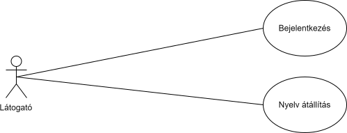
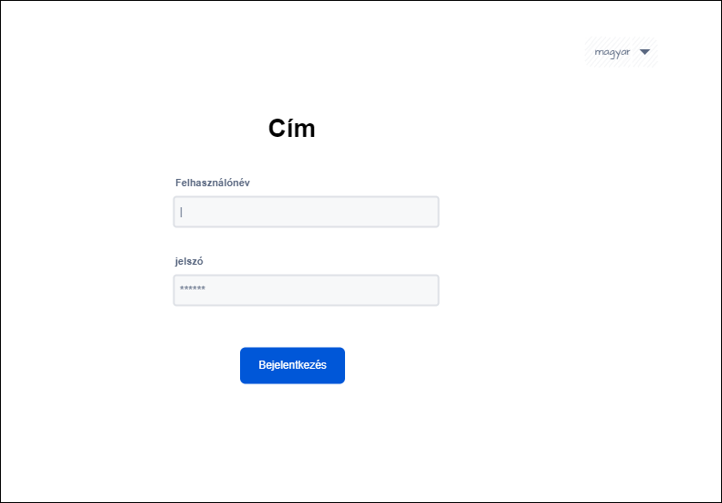
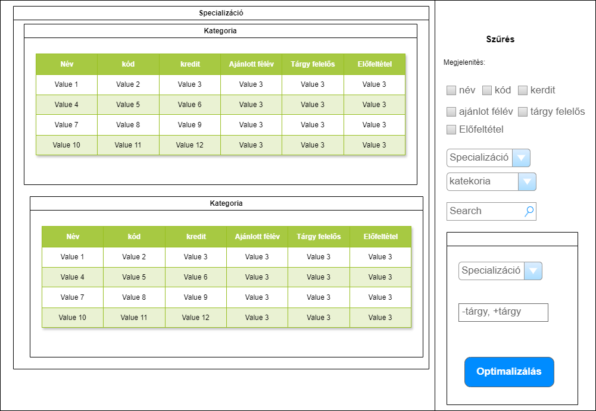
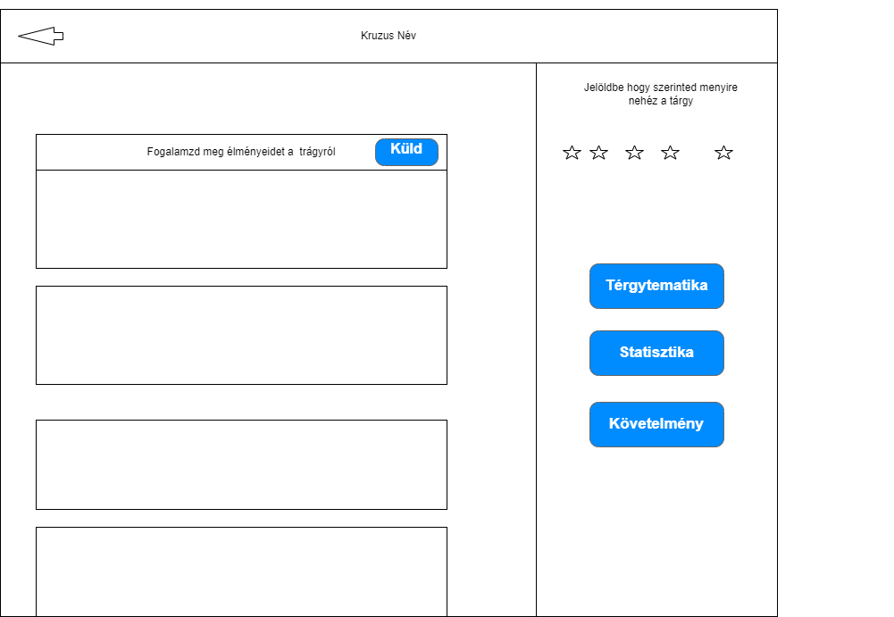
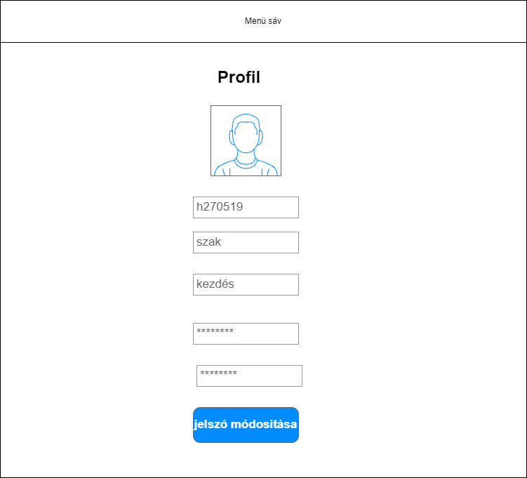
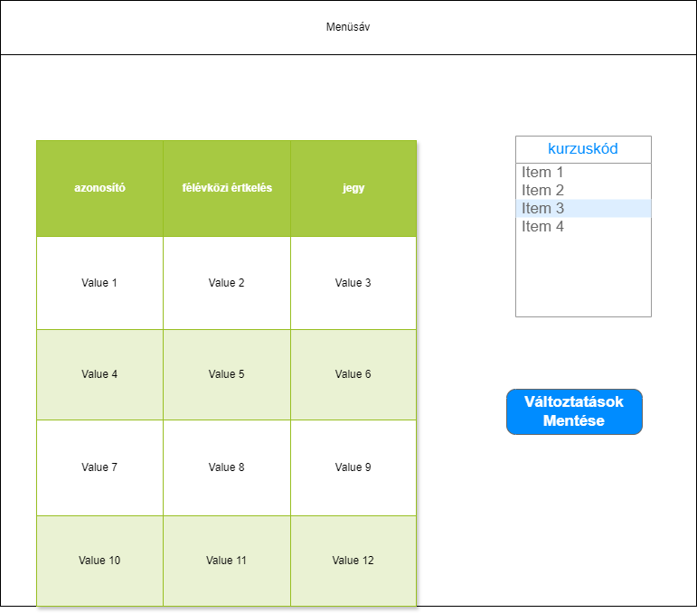
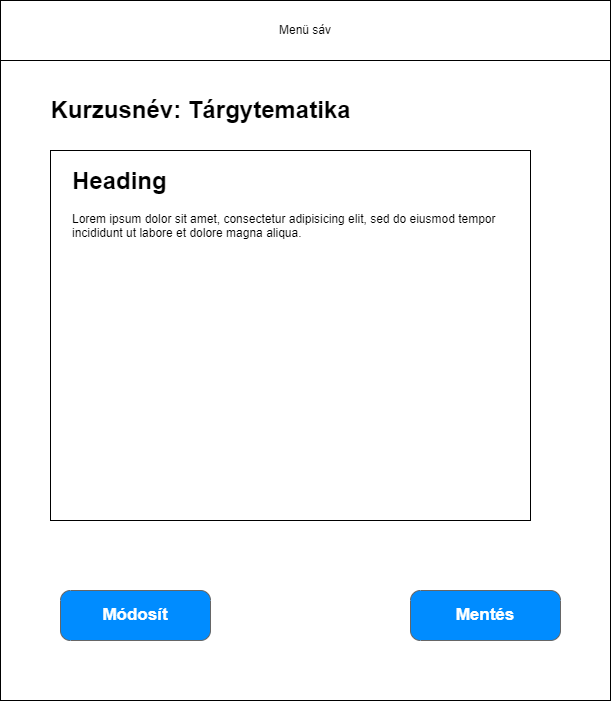
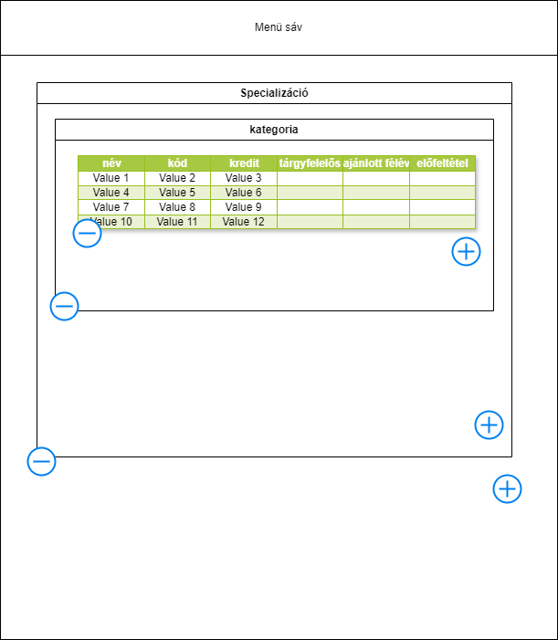
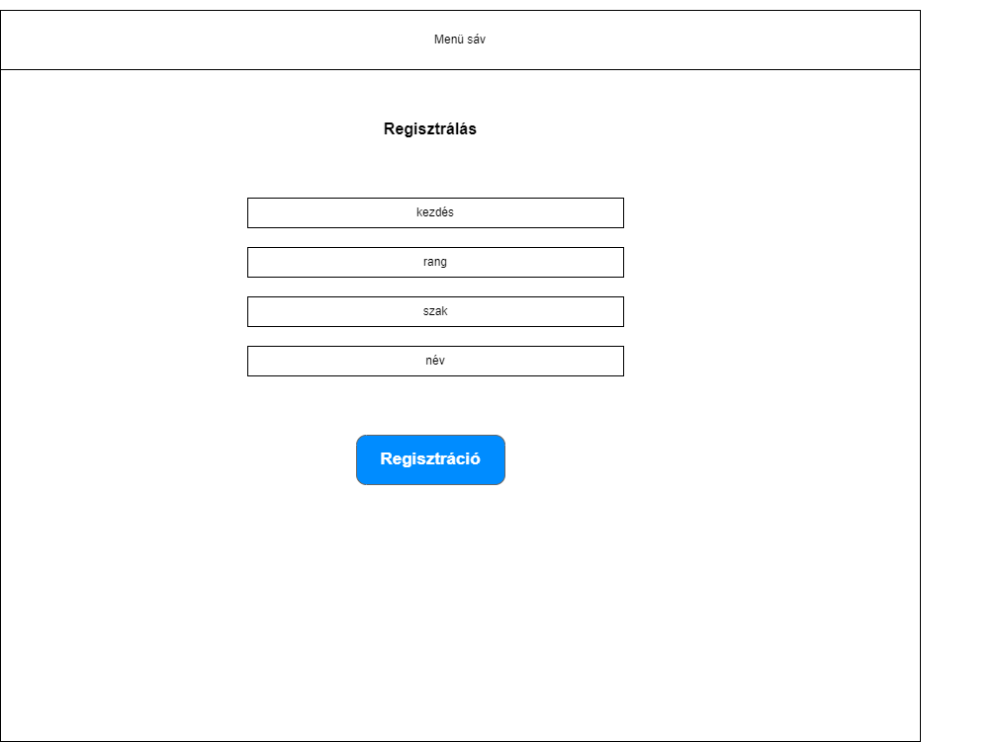

# **Szakdolgozat**

## Halgatói adatok
**Név**: Varga Zoltán  
**Neptun kód**: V64FGJ  
**Halgatói azonósító**: h270519  
## Témavezető
Dr. Bilicki Vilmos    
## Téma terv készitésének időpontja
A diplomamunka elkészitésével 2024/2025 I. félévben kezdtem el foglalkozni és remélhetőleg 2024/2025 II. félévében végzek.
## Diplomamunka címe:
Félévtervező
## Motiváció
A Szakdolgozatom célja, hogy egy olyan web aplikáció készitsek ami megkönyitené a tárgy felvételi időszakot a diákok társaim számára és egy olyan visszajelzéseket nyujathatna az oktatóknak ami segítheti a tantárgyak fejlesztését egyaránt.  
Egyetemisták százai kapkodnak a fejük után minden egyes tárgyfelvételi időszak keztetén mivel nem érzik magukat elég informáltnak ahoz hogy milyen szabadon- és köletezőenválasztható tárgyakat kellene felvenijük hogy ambiciójiknak és érdékelödési köreiknek megfelelhesenek. Ugyanis sokak szerint a A Neptun mintaterve csak a kurzus nevét és az ajánlot félévet teszi közzé támpontként, ami sokszor elégtelenek bizonyul ilyne fontos döntések meghozatalában.   
A Tantárgy követleményeiről és anyagáról sokszor csak versenyalapú tárgyfelvétel útolsó egy két hetében tudatják a diákokkal egy teljesen másik Coospace nevü platformon, de ilynekor már sokszor késő változtatni.   
Csak kevesen veszik észre de a Neptun biztosít tárgy tematikákat letölthető pdf-ek formályában de ezke gyakran hiányoznak vagy olyan definiálatlan szakszavakkal van megfogalmazva, ami egy a gyakorlatlan, a kurzust el nem végző diák perspektivájából érthetelen.  
 Az oktatási szoftverek sokszor elhanyagolják a statisztikák készitését illetve közétételét is. Általában csak a legáltalánosabb a gyakoriság megoszlásokat készitenek el melyek nem veszik figyelembe az adatok keletkezéseinek körülményait (*például: Az érdemjegyek megoszlásába beleszámonak olyan bukot holgatók értékeit is akik nem jelentek meg a tanórákon és vagy nem írták meg a tárgyhoz kapcsolodó felméréseket, ami egyértelmüen torzitja a tárgy teljesíthetőségéről szoló predikciókat.*).  
 Problémának tartom azt is, hogy a diákonak nincs egy álandó platformuk,  ahol visszajelzést adhatnának a pedagogusaiiknak csak egy félévégi sablonos kérdöív van amikben olyan semilyne kérdéseket tesznek fel mint *"Ön szrint menyire volt felkészülve az oktató az órira"* amik csak hasonlóan lagymatag válaszokat lehet adni hogy *"Ja"* ami nem segít az oktatónak az esetleges hiányoságok detektálásában.  
A felsorolt hibák orvosolására teszek késérletet a diplomamunkám formályában.   
A tantervet olvashatóbbá teszem  azzal hogy szürhető és rendezhető lesz atributumai alapján.   
Lehetővéteném hogy a tanuló megadott feltételei alpján egy a célkitözésének megfelelő optimalizált tantervet genráljon, annak érdekében hogy az amibicióiknak megfelellő tantervet válaszhasanak.  
Azért hogy támpontokat adjak a tárgyfelvételi idöszakokban minden kurzushoz csatolok egy forumot a hol a diákok értékkelhetik a tárgyakat és  visza jelzéseket küldthetnek a tárgyról a tanároknak. Ugyan itt elérhetővéteném a tárgyhoz tartozó statisztikákat , illetve az lehetőséget biztositanék arra hogy az oktatók feltöltsék a tárgy tematikát és az előző év követelményét hogy azaz a tágy felvételenélkül képes lesznek megnézzni a tágy adatait.  
Ebből már logikusan következik hogy több jogosuktsági szintet különböztetnék meg az webapon belül. névszerint Admin, tanár és diák.  
A tanároknak lehetőségük lesz a tantervek létrehozására és modosítására illetve a hozájuk tartozó tárgyakhoz tartozó dolgozatok pontjainak/jegyinek beirását a diákjaik naplóiba, amit a diákok a saját felületükön tudnak megnézni.  
Az admin minden funkcióhoz eyszre hozzáfér, illetve Ö az aki regiszrálja a többi felhasználot mint minden más oktatási szoftverben (*Neptunra, Coospacere, Moodulere, stb... nem regisztrálhat akárki biztonsági okoból*).     
## Funkcionális specifikáció
### Föbb funkciók:
- **Eltronikus ellnörző:** A tanárok képesek a diákjaik pontjait évközben szerzet pontjait illetve késöbbi jegyeiket naplózni, amit a diákok a saját felületükön képesek olvasni.  
- **Tanterv készitő:** platformot piztosít a tanároknak a tantervek készitésében, modosításában.  
- **Tanterv megjelenités:** Megjeleniti a tantervet a diákoknak.  
- **Tanterv szürés:** szürhetővéteszi a tantervet tulajdonsági alapján a diákoknak.  
- **Tanterv keresés:** kereshetővéteszi a tantervet a diákonak.  
- **Tanerv rendezés:** Rendezhetővéteszi a tantervet egyes tulajdonságai alpján a diákonak.  
- **Optimalizált tanterv generálása:** Személyre szoló tanterv generálása a diákonak megadot feltételek alapján és cél alpján.  
- **Belépés:** Belépteti a felhasználokat.  
- **Regisztrálás:** Az admin felhasználó létrehoz új felhasználókat.  
- **Profil:** A felhasználói adatok megjelenitése modosítása.  
- **Kijelentkezés:** Kilehet jelentkezni.  
- **Kurzus Forum:** felületet ad a kurzus értékeléssére a diákok számára. A tanárok itt tehetnek közé tárgytemaiták és követelményeket.  
- **Nyelv átálitása:** Átlehet álitani az oldal nyelvét magyaról angolra és visza.  
## Válaszotott technológiák
- Angular  
- TypeScript  
- Firebase  
- Html  
- SCSS  
- Node.js  
## Piackutatás
| | **Vesenytársak** | **[CooSpace](https://www.coosp.etr.u-szeged.hu)** | **[Neptun](https://neptun.szte.hu)** | **[Moodle](https://moodle.pte.hu)** | **[Kréta](https://klik-kreta.hu)** |
--- | --- | --- | --- | --- | ---
| **Funkciók** | |
| **Belépés** |  | ✅ | ✅ | ✅ | ✅ |
| **Regisztráció Admin által** |  | ✅ | ✅ | ✅ | ✅ |
| **Tanterv megjlenitése** |  | ❌ | ✅ | ❌ | ❌ |
| **Tanterv rendezhetősége** |  | ❌ | ✅ | ❌ | ❌ |
| **Tanterv szürhetősége** |  | ❌ | ❌ | ❌ | ❌ |
| **Tanterv kershetősége** |  | ❌ | ✅ | ❌ | ❌ |
| **Tanterv Optimalizálása** |  | ❌ | ❌ | ❌ | ❌ |
| **Tanterv készitő** |  | ❌ | ✅ | ❌ | ❌ |
| **Eletronikus ellenörző** |  | ✅ | ✅ | ✅ | ✅ |
| **Kurzus Forum** |  | ✅ | ❌ | ✅ | ✅ |
| **Statistikák generálása** |  | ✅ | ✅ | ✅ | ✅ |
| **Többnyelvűség** |  | ✅ | ✅ | ✅ | ✅ |
| **Modern minimalista megjelenés** |  | ✅ | ✅ | ✅ | ✅ |
| **Kurzusok véleményezése** |  | ❌ | ✅ | ❌ | ❌ |
| **Tárgy tematika megadása** |  | ❌ | ✅ | ❌ | ❌ |
| **Követelmények megadása** |  | ✅ | ❌ | ✅ | ❌ |
### Megjegyzések
Azt lehet megfigyelni, hogy a Rendszelgazda általi regisztrálás, a töbnyelvüség és a modern minimialista két-három alap színekből álló desing,  és az eletronikus ellenörzés alapvetőek az oktatási szoftverek piacán. Ezekre a funkciókra mint biztos alapra kiemelt figyelmet kell forditanom a fejlesztés során, de az is jól látszik hogy egyetlen egy piaci szerplő sem fokuszált a tantervek kezelésére vagy a kurzusok leirására. Ezeken a területken egy kiss szerencsével valami újat és egyesit alkothatok. 
## Use-Case
### Látogató
A látogató minden olyan felhasználó aki még nem jelentkezetbe. Csak bejelnezkezés és a NYelv átálitás(weboldal nyelvének átálitása) funkciókhoz fét hozzá.  

### Bejelentkezett felhasználó
A bejelentkezett felhasználó képes megneézni a saját felhasználói adatrait megváltoztani a jelszvát megnézni a tantervet azt rendezni optimalizálni szűrni és keresni addot feltételek alapján, illetve minden a tantervben megjelenitett kurzushoz tartozik egy kurzus forum amit a tantervben rákatintva érhet el. A kurzus forumban lehetőségevan saját szavaival leírni mirőlszól a tárgy megadni hogy szerinte menyire nehéz és megnézni a statisztikákat a tárgytemetikát és a követelményeket és ki tud jelentkezni.

### Diák Tanár és Admin felhasználó
Mind a három felhasználó típús a Bejeletkezett felhasználóból öröklödik. Azaz minden funkcióval és jogosultcsággal rendelkezik mint az ős. A diák az örökölt funkciókon túl hozzáfér az elektronikus ellenörzőjéhez ahol képes megnézni a jegyei alakulását és felveni új tárgyakat. A tanár képes a saját kurzusához tartozó követelményeket és tárgytematikákat hozzáadni a kurzusforumhoz illetve értékelni a diákok félév közi és végi munkáikat (*a félévközi értékelés allat a dolgozatok pontszámaira míg a félév véginél az érdemjegyre gondolok. Azt hogy melyik tanár hozmelyik kurzus tartozik azt a tanterv tárgy felelős mezőből lehet megkapni.*). Az admin felhasználó értelem szerüen hozzáfér az összes emlietett funkcióhoz kivéve az diák ellenörzőjéhez, mivel a diákok jegyeihez már a tanár jegyek kezelése funciójából hozzáfér.

## Képernyő tervek
A felhasználó Elöször a belépés oldalal talákozik ahol bejelentkezik jelszó azonosító párossal illetve leheőségében áll át álítani az oldal nyelvét az alapértelmezet magyarról.  

Sikeres bejelentkezés után a tanterv oldalára irányitodnak át ahol zürhezik rendezhetik kereshetik és optimalizálhatják is.  

Ha itt tanterv oldalán rákatintanak egy kurzusra akor átirányitodnak a hozzá tartozó kurzus forumra, ahol megnézhetik a tárgy tematikát a követleményeket a statisztikáktat az értékeléseket és a többi felhasználó véleményét a térggyal kapcsolatosan innét a viszza nyillal lehet visza térni a tantervre.  

A menüsávot használva át navigálhatnak a profil oldara és megnézhetik a saját felhasználói adataikat a profil odalon és megváltoztathatják a jelszavukat.  

A menüsávot használva át navigálhat a diák az elenörző oldara ahol megnézheti a saját elenörzöjét és hozzáadd hat új tárgyakat az aktív félévéhez.  

A menüsávot használva át navigálhat a tanár és az admin felhaszáló a jegyek kezelése oldalra hogy a kurzusát az aktivfélévben hallgató halgatók tanumányait érékeljek.  

A menüsávot használva át navigálhat a tanár és az admin felhaszáló a tárgytamatika vagy követelmények kezelése oldalrakra hogy megadhasa ezeket az adatokat.(*MIvel mind két oldal terve ugyan az lenne így csak a tárgyteamtika kelelését mutatom.*).  

A menüsávot használva át navigálhat az admin felhaszáló tanterv készitő oldalra ahol létrehozhatja a tantervet. A pluszgombra katintva hozzáadd a minsusz gomra katintva pedig elvesz elemeket.  

A menüsávot használva át navigálhat az admin felhaszáló a új felhasználó kezelése oldalra ahol új felhasználót tud regisztrálni.  

## Egyed Kapcsolat

## Ütemezés 
### Első félév:
- Szeptember
    - Porotípus írása kotlin kmp keretrendszerben AI használatával
- Október
    - projekt újra tervezése a követelmények ismeretében
    - nyilatkozás Ai nem használatáról
    - Szakmai motiváció megírása
    - Use-case elkészitése
    - Képernyő tervek elkészitése
    - Egyed Kapcsolat diagram elkészitése
    - Ütemtemezés elkészitése
    - Git repositori létrehozása
- November
    - Projekt újra kezdése Angularban
    - Angular keretrendszer alapjainak elsajátitása
    - Firebase integrálása
    - Autentikáció implementálása
    - Oldalak létrehozása alapszintü routing létrehozása
    - jogosultcság kezelés és Guard-val védet routing kialakitása
    - Firebase FireStore adatbázis létrehozása
    - CRUD müvelet létrehozása service-ekként
- December
    - Alapfunkciók implementálásank megkezdése
- Január
    - Alapfunkciók implementálása
### Második Félév:
- Február
    - Alap funkciók implementálásának befejezése.
- Március
    - Optimalizálási algoritmus implementálása
- Április
    - Design elkészitése
    - Oldal szövegének lefordítása
- Május
    - Statikus tesztelés ESLint-vel
    - Unit teszek készitése
    - E2E tesztelés

## **Optimalizálás**  

### Multi periodikus egészértékü programozás

Specializáció | Kategoriák
---|---
spec1 |kat1, kat2
spec2 | kat3

Kategóriák | Kurzusok | Minimum keredit
---|---|---
kat1|k1, k2, k4, k5| 9
kat2| k3, k6, k7 | 8
kat3| k8, k1, k2| 7

Kurzusok|Kredit|Követelmény|Szezon|Ajánlott félév
---|---|---|---|---
k1 | 3 | - | Bármikor | 1
k2 | 3 | - | Ősz | 1
k3 | 2 | - | Tavasz | 2
k4 | 4 | k2 | Ősz | 3
k5 | 4 | k4 | Tavasz | 4
k6 | 5 | k3 | Bármikor | 3
k7 | 8 | - | Tavasz | 2
k8 | 4 | - | Ősz | 1

$c_{i,t}$ = Az i-edik típusú kurzusból hány darabot választunkbe a t-edik félévben.  
$v_i$ = Az i-edik kurzus kredit értéke  
T = a félévek száma  
n = a kurzusok száma
$k_i$ = kategoriák minmum kerditje,
$s_i$ = specializációk

Z = $ \sum_{t=1}^T \sum_{i=1}^n c_{i,t}->min$  

**Feltételek:**  
$\sum_{i=1}^n \cdot v_i \leq 40$ $\forall t | 1 \leq t \leq T$  
$x_{i,t} \geq 0, x_{i,t} \in \Z$
$\sum_{t=1}^T \sum_{i=1}^n v_i \cdot c_{i,t} \geq minum követelmény$

## Fórrásaim:
- https://angular.dev 
- https://roadmap.schdesign.hu/schdesign/tutorial/markdown-alapok/   
- https://inf.u-szeged.hu/~gnemeth/adatbgyak/exe/EK_diagram/az_egyedkapcsolat_diagram_elemei.html  
- https://material.angular.io/components/categories  
- https://www.youtube.com/@MonsterlessonsAcademy  
